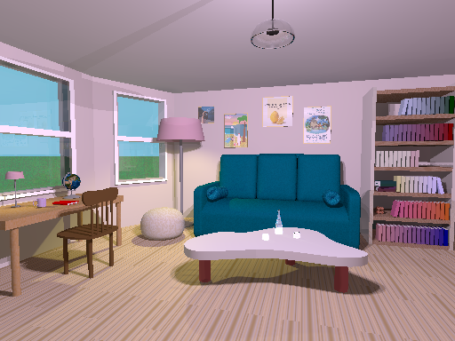

## 🏠 3D Room Scene in POV-Ray

This project creates a detailed 3D interior scene using POV-Ray, featuring furniture, a bottle, glasses, books, and atmospheric lighting to produce a photorealistic room render. The goal is to build a cozy and aesthetically pleasing living space with realistic materials like glass, wood, and fabric.

## 🧩 Overview

This POV-Ray script constructs an indoor scene with:

Custom 3D models such as a bottle, glasses, books, a couch, lamp, and more

Realistic materials for glass, wood, and fabrics

Complex bezier splines for smooth shapes (like the bottle)

Natural lighting with radiosity and photon mapping for enhanced realism

Carefully placed camera with depth-of-field effects for a pleasing composition

Textured surfaces including floors, walls, and furniture

## 🛠️ Some features

Bouteille (bottle): Modeled with lathe and bezier splines for smooth, curved shapes and glass-like material with refraction

Glassware: Transparent glasses filled with water simulated using nested lathe objects and correct refractive indexes

Furniture: Tables, chairs, poufs, bookshelves, and cushions with detailed textures and colors

Lighting: Multiple light sources including soft area lights and colored illumination for mood

Materials: Physically inspired finishes with reflection, diffuse, and specular parameters for realism

Camera: Fisheye lens and adjustable aperture for artistic depth of field

## 🎨 Rendering Tips for Good Aesthetic

Use soft area lights with slight color tinting (e.g., warm or magenta hues) for cozy ambiance

Employ radiosity and photon mapping to simulate natural light bounces and subtle global illumination

Set camera with depth of field (aperture and focal point) to focus on key objects, blurring the rest

Choose materials with realistic reflections and refractions — glass with IOR ~1.5, water ~1.33

Use turbulence and color maps on textures to add natural variation and avoid flat surfaces

Of course, the quality of the final picture can be improved, but that was not the case here in order to avoid endless calculation time.

## 📷 Sample Render

#
Here you can find more of my projects : https://github.com/themissellier/My-projects
